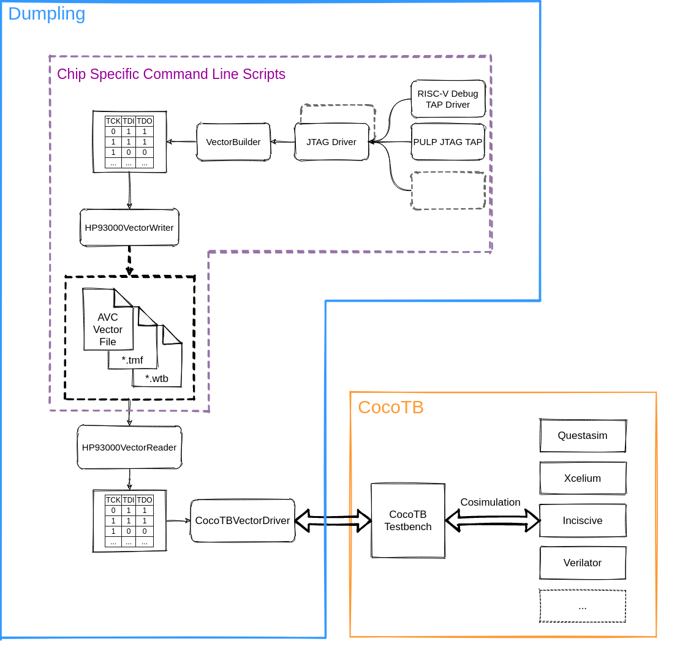

===========
Dumpling
===========

**Dumpling** is a tool to generate and simulate vectors for the HP93000 ASIC
tester. It is both a library for vector generation and JTAG bitbanging in
general as well as a command line tool to generate vectors for a set of
supported PULP chips. The original goal of dumpling was to stream line the
procedure to generate ASCI Vector files for the HP93000 tester (AVC files).
Before dumplings emergence, vectors that would boot a given ELF binary or
configure the DUT using specifig JTAG taps would have to be created by
recording vector dumps from an RTL simulation or handcrafting of the vectors.
While one could argue that vectors recorded from RTL simulation are the better
approach since they stem from the actual functional model of the device under
test, there are a number of significant downfalls of the traditional VCD dump
method:

- The output signals are always recorded. Most of the time (especially during
  reset) we do not care about the actual value of the output signals. We only
  want to sample and checkt the outputs at very specific points during the
  simulation (e.g. when we verify the content of some JTAG register or perform
  a memory readout). If we cannot perfectly control the clock and phase
  relation of the stimuli clock (e.g. JTAG TCK) and the systems clock, the DUT
  on the tester might show slightly different responses (e.g. shifted by one
  cycle than the RTL simulation). Without knowing when we actually care about
  the outputs and when it's just garbage to ignore, it is hard to interpret the
  mismatches reported by the ASIC tester.

- The recorded vectors contain zero context about what they actually do. This
  is especially important during debugging when there are mismatches. If we do
  not know the role/meaning of a single vector in a 10'000 vectors long AVC
  file reporting mismatches, we will have a very hard time figuring out what
  actually causes the discrepancy.

   Architectural Overview of Dumpling

Dumpling is different from the VCD dump approach. Instead of performing RTL
simulation to generate the vectors it bitbangs the actual protocol in a modular
manner. The generated vectors are extensively annotated with comments that
provide context of what the current vector is supposed to do with the DUT.
Furthermore, by not using RTL simulation the generation of vectors, e.g. to
perform a complete ELF binary boot procedure and end of computation check, is
orders of magnitude faster than running the full blown testbench on the RTL of
a huge multi-core PULP chip.

With its modular architecture, dumpling is easy to extend with additional
protocols, JTAG taps or CLI scripts for chip specific vector generation. Since
vectors are internally handled using a very simple intermediate representation,
new output formats other than the HP93000's AVC format can easily be added to
the library. In addition to the vector generation capabilities **dumpling**
also provides the means to verify the vectors in RTL simulation using the power
of CocoTB_, a python interface for rapid RTL testbench development with support
for pretty much every RTL simulator there is. This allows to simulate arbitrary
AVC files (not just the ones created with **dumpling**) with only a couple
lines of Python and Makefile code and is an invaluable tool to hunt down
mismatches reported on silicon.
 
.. note::

   Dumpling is still in it's very early stage of development and might still
   experience refactoring and breaking changes in the future.
